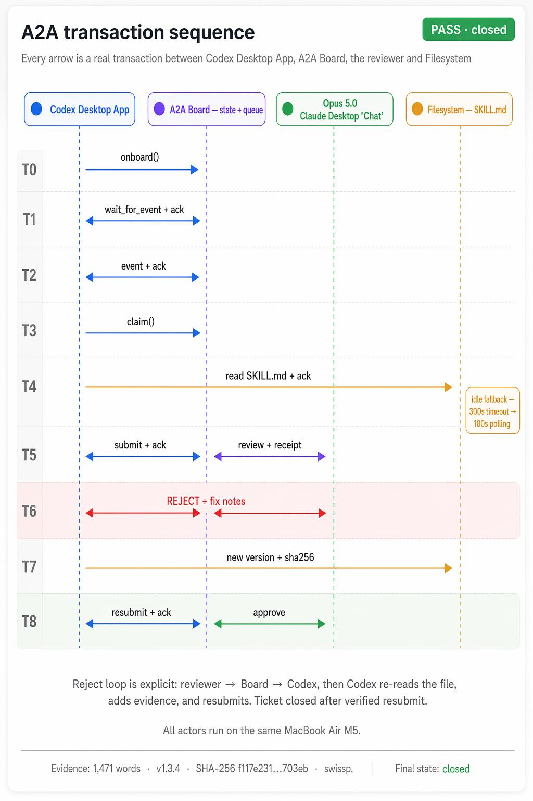

# On Board

> Shared project memory for agents.
> One MCP server, one project memory folder, many IDEs and agent clients.
> **New in v4.0.0:** agents wake each other. The human stops being the message pump.

[](LICENSE)
[](https://modelcontextprotocol.io)
[](https://lobehub.com/mcp/swisspra-on_board)
[](https://github.com/swisspra/On_Board/releases/latest)
[](#agent-to-agent-the-listening-half-v4)

---

## What this is

On Board is a local MCP server for coordinating AI agents across a project.
It gives Claude Desktop, Claude Code, Codex, Cursor, Antigravity, and other
MCP clients the same project memory, ticket queue, and handoff history.

The goal is simple: when one agent stops and another agent continues, the next
agent should not need the human to explain the project again.

```
onboard → read memory → claim work → write progress → hand off
```

Everything stays local to the project unless you choose to connect other tools.

---

## 🚀 v4.0.0 — agents now wake each other

Until v4 this board was pull-only: an agent found out about new work when a
human told it to look. **v4 ships `memory_wait_for_event`** — an agent parks
inside one tool call and wakes the moment a peer creates a ticket, submits
work, or delivers a verdict.

This is not a demo claim. In the launch trial, **a GPT agent (Codex) and a
Claude agent closed a full reject → fix → resubmit cycle on this board with
zero human relay** — the reviewer's fix instructions travelled inside the wake
payload, the worker re-read the file, attached a sha256, and resubmitted; the
reviewer reproduced the hash byte-for-byte before approving:



Full mechanics in [Agent-to-agent: the listening half](#agent-to-agent-the-listening-half-v4) ·
breaking changes in [CHANGELOG.md](./CHANGELOG.md) ·
[release notes](https://github.com/swisspra/On_Board/releases/tag/v4.0.0).

## Why this exists

Most agent workflows break for boring reasons:

- The next chat does not know what the last chat did.
- Parallel agents overwrite or redo each other's work.
- Important decisions live only in conversation history.
- Handoffs are informal, so review and follow-up work drift.

On Board keeps those facts in project-local files under `.agent-mem/`.
The MCP tools expose that memory to any supported client.

## Who this is for

- Solo developers using more than one agent or IDE
- Teams experimenting with multi-agent coding workflows
- Projects where handoffs, tickets, and review notes matter
- Local-first MCP users who want shared context without a hosted service

It is not an autonomous project manager. Humans still decide what matters,
review important changes, and accept the final result.

---

## Quick start

### Install the server

The server is published as [`onboard-memory-mcp`](https://pypi.org/project/onboard-memory-mcp/).
Install it with whichever tool you prefer:

```bash
# Homebrew (tap once, then the short name works: brew install onboard-memory)
brew install swisspra/tap/onboard-memory

# pipx
pipx install onboard-memory-mcp

# uv
uv tool install onboard-memory-mcp
```

All three provide the `onboard-memory-mcp` command (Homebrew also adds a short
`onboard-memory` alias). Homebrew covers macOS and Linux; on **Windows** use
pipx or uv (the command is `onboard-memory-mcp.exe`). Point your MCP client's
`command` at it instead of `python3 onboard_server.py`. You can also skip this
and run from a clone using the setup paths below. (On Homebrew 6+, approve the
one-time tap-trust prompt, or run `brew trust swisspra/tap`.)

#### Headless config (no clone)

With the server installed, wire your MCP client to it directly — no repo
checkout, no `setup-project.sh`:

```json
{
  "mcpServers": {
    "agent-memory": {
      "command": "onboard-memory-mcp",
      "env": { "AGENT_PROJECT_DIR": "/full/path/to/your/project" }
    }
  }
}
```

- **CLI clients** (Claude Code, Codex) inherit your shell `PATH`, so the bare
  `onboard-memory-mcp` works.
- **GUI clients** (Claude Desktop, Cursor) launch with a minimal `PATH`. Use the
  absolute path from `which onboard-memory-mcp` (`where` on Windows) as
  `command` — typically `/opt/homebrew/bin/onboard-memory-mcp` (Homebrew, Apple
  Silicon), `/usr/local/bin/onboard-memory-mcp` (Homebrew, Intel),
  `/home/linuxbrew/.linuxbrew/bin/onboard-memory-mcp` (Homebrew, Linux),
  `~/.local/bin/onboard-memory-mcp` (pipx / uv on macOS/Linux), or
  `%USERPROFILE%\.local\bin\onboard-memory-mcp.exe` (pipx / uv on Windows).

`AGENT_PROJECT_DIR` is required — it decides which project owns `.agent-mem/`.
In your first chat, call `memory_init` once (creates `.agent-mem/`), then
`memory_onboard` each session. Nothing to create by hand.

The `pipx`/`uv` path installs from prebuilt wheels (no compiler) on Python 3.11+
for Linux, Windows, and Apple-Silicon macOS; on Python 3.10 or Intel macOS a
couple of Rust/C dependencies may build from source, so prefer `brew` there.
Template: [configs/binary-mcp.json](./configs/binary-mcp.json); full detail and
platform notes in [docs/SETUP.md](./docs/SETUP.md).

### Set up a project

Choose one setup path:

#### Option 1: Agent setup

Ask an agent to read [AGENT_SETUP.md](./AGENT_SETUP.md) and help you set up the
project. This is the easiest path if you already have an agent available.

#### Option 2: Script setup

```bash
git clone https://github.com/swisspra/On_Board.git
cd On_Board
bash setup-project.sh /full/path/to/your/project
bash doctor.sh /full/path/to/your/project
```

Add the generated MCP config to your client:

```text
/full/path/to/your/project/.onboard/mcp.generated.json
```

Some clients accept this JSON directly. Others require you to merge it into
their own MCP settings file.

After memory is initialized, open the dashboard with:

```bash
bash /full/path/to/your/project/.onboard/run-dashboard.sh
```

On Board is installed once. Each project points to the same On Board folder,
but gets separate memory through `AGENT_PROJECT_DIR`.

Each `setup-project.sh` run also registers the project locally in
`.onboard/linked-projects.json` inside the On Board checkout. This file is
gitignored and only helps updates remember which projects point here.

The setup script uses `uv sync --inexact` to install/update dependencies without
pruning local test/dev extras. MCP clients run `python3 onboard_server.py`; the
launcher uses the local `.venv` directly and rebuilds it only if the venv is
missing. This keeps normal startup fast, avoids `uv run` startup timeouts, and
makes a shared central checkout more durable.

On Board does not write memory from end-turn hooks. Current `Stop` hooks in
several agent clients run every turn, which creates noisy memory and can force
agents to re-onboard too often.

Optional: add `AGENT_MEM_CONTEXT_DIRS` to the generated MCP config when agents
should read shared docs/specs outside the project folder.

#### Option 3: Advanced manual setup

If you do not want to run the setup script, install with `uv sync`, write the
MCP config yourself, and add project rules/hooks manually. See
[docs/SETUP.md](./docs/SETUP.md).

In your first chat with any MCP-aware agent (Claude Desktop, Claude Code,
Cursor, Codex, Antigravity):

```
memory_bootstrap(
  agent_name="dev-main",
  description="Existing project using On Board",
  current_task="Set up shared project memory"
)

memory_onboard(
  agent_name="dev-main",
  agent_platform="claude-code",
  agent_role="main"
)
```

That's it. The agent now sees the project briefing, the open tickets, the
recent memory, and the protocol it should follow. Every subsequent action
is stamped with its identity.

Full setup details and manual setup: see
[docs/SETUP.md](./docs/SETUP.md).

To update an existing install, run `bash update.sh` in the central On Board
checkout. It will show known linked projects. Refresh all of them with
`bash update.sh --refresh-linked`, or inspect them with
`bash setup-project.sh --list-linked`.

---

## The loop in one example

```
1. SPEC
   opus-testcase reads requirement → writes 5–20 acceptance tickets
   with explicit pre/post conditions.

2. BUILD
   dev-track-2 claims a ticket → implements in src/ → submits with
   file diff + test plan.

3. TEST
   Jonhny-tester picks up submission → runs UI in Chromium → captures
   screenshots → submits PASS or FAIL with evidence.

4. REVIEW
   desktop-opus4.7 (or the human) checks evidence → approves OR rejects
   with concrete fix instructions.

   If rejected → ticket reopens → dev-track-2 patches → Jonhny retests
   → loop closes.
```

When this loop runs cleanly, a single ticket goes from `open` to "shipped
to production" in 4–15 minutes of agent time. The human checks in at the
end, not in the middle.

---

## Agent-to-agent: the listening half (v4)

Everything above still works pull-style. v4 adds the missing edge: agents can
now **wake each other** instead of waiting for a human to relay messages.

```
worker:  memory_wait_for_event(agent_name="dev-track-2", timeout_s=180)
         → parks inside one tool call until the board changes
lead:    memory_create_ticket(..., assigned_to="dev-track-2")
worker:  wakes in seconds, claims, works,
         memory_submit_ticket(..., stay_active=True)
lead:    wakes on the submission, reviews
worker:  wakes on the verdict — approve closes the loop;
         a rejection arrives WITH the review notes and fix
         instructions in the wake payload, so it re-claims,
         fixes, and resubmits without asking anyone
```

Design points, all field-verified across Claude Desktop × Claude Desktop and
Claude × Codex (GPT):

- **Check before blocking** — a re-arm after a gap returns its backlog in 0 s
  instead of waking empty. One wake drains the whole queue.
- **Loop guard** — an agent never wakes on its own actions, so two listeners
  cannot ping-pong each other.
- **Role gate** — *completed ≠ success*: whoever executed a ticket may reach
  `submitted` but may never close it; only the owner or a main/lead/reviewer
  adjudicates. Solo use is still possible via explicit `allow_self_review=True`,
  permanently stamped in the audit.
- **Client limits respected** — Claude Desktop cancels tool calls at ~240 s
  *per call* (measured), so timeouts clamp to 200 s there; stdio clients
  (Claude Code, Codex) may pass `long_wait` and park much longer.
- **Idle budget, in minutes** — the server counts consecutive empty parks and
  answers `STAND-DOWN` once `idle_budget_min` (default 15) is spent, so an
  unattended listener stops on its own instead of looking wedged. Budgets are
  stated in minutes because a human watching a silent loop counts wall clock,
  not iterations — a compliant agent looping for 20 minutes looks stuck even
  when it is exactly on budget. Every idle reply prints `idle 3/5 — ~6 min to
  stand-down`. The counter resets on a real event and never on re-arming, and
  `STAND-DOWN` is a distinct status so a loop matching on `idle` cannot read it
  as permission to continue. `idle_budget_min=0` listens indefinitely.
- Use the `listen` MCP prompt for the standard re-arm loop.

v4 also hardens the board for simultaneous writers (advisory lock on ticket
mutations, per-process tmp files), because with A2A two agents acting in the
same instant is the normal case, not the rare one. Breaking changes and the
migration guide live in [CHANGELOG.md](./CHANGELOG.md).

---

## Tools (29 MCP tools, 5 buckets)

| Bucket | Tools |
|---|---|
| **Agent lifecycle** | `memory_onboard`, `memory_agent_join`, `memory_handoff`, `memory_checkpoint`, `memory_get_briefing`, `memory_wait_for_event` |
| **Ticket queue** | `memory_create_ticket`, `memory_claim_ticket`, `memory_submit_ticket`, `memory_review_ticket`, `memory_cancel_ticket`, `memory_terminate_ticket`, `memory_list_tickets` |
| **Persistent memory** | `memory_write`, `memory_read`, `memory_search`, `memory_search_vector`, `memory_links` |
| **Project context** | `memory_init`, `memory_bootstrap`, `memory_status`, `memory_doctor`, `memory_update_state`, `memory_context_dirs`, `memory_context_read` |
| **Compaction** | `memory_prepare_compaction`, `memory_compact`, `memory_token_usage`, `memory_search_archive` |

Full reference: [docs/TOOLS.md](./docs/TOOLS.md).

---

## What makes this different

On Board is not only a place to store memories. It keeps the work loop visible:

```text
onboard -> claim ticket -> submit evidence -> review -> approve or reopen
```

That gives agents a shared queue, stable identities, recent handoffs, and a
review gate. Rejected work reopens with fix instructions instead of becoming a
dead terminal state.

---

## Project structure (runtime data)

```
your-project/
├── .agent-mem/                runtime memory, gitignored
│   ├── project.json
│   ├── agents.json            agent registry (identity, status, KIA)
│   ├── memories.json
│   ├── state.json             project phase, owner, design defaults
│   ├── archive.json
│   ├── digests.json
│   ├── checkpoints/
│   └── tickets/
│       ├── _index.json
│       ├── TK-<id>.md         the spec
│       ├── TK-<id>-submit.md  dev submission
│       ├── TK-<id>-review.md  QA / reviewer verdict
│       └── closed/
```

Everything is plain text or JSON. You can `cat` your way through the
project's full history. No vector DB lock-in, no opaque embeddings — just
files an audit can read.

---

## Current status (v4.0.3, August 2026)

The current local setup is built around one central On Board checkout and one
project-selected memory folder:

- `memory_onboard` is the primary start call for agents and returns compact current context.
- `memory_wait_for_event` turns the board push-capable: agents park, wake on peer
  actions, and close reject/retry loops with zero human relay (see the A2A section).
- `memory_doctor` checks setup and data integrity.
- `setup-project.sh` generates project MCP config, rules, startup hooks, and a
  dashboard launcher.
- Linked-project registry tracks which projects point at the central checkout,
  so updates can refresh known projects without scanning the machine.
- Runtime startup uses `python3 onboard_server.py`; the launcher normally
  execs `.venv/bin/python server.py` and only falls back to `uv sync --inexact`
  if `.venv` is missing.
- Startup hooks return a small read-only briefing. End-turn/Stop hooks are not
  installed by default because current clients can run them too often.
- The dashboard is local and read-only.

Full CHANGELOG: [CHANGELOG.md](./CHANGELOG.md).

---

## License

Apache-2.0. Free to use, fork, modify, redistribute, build commercial
products on. No restrictions on use.
